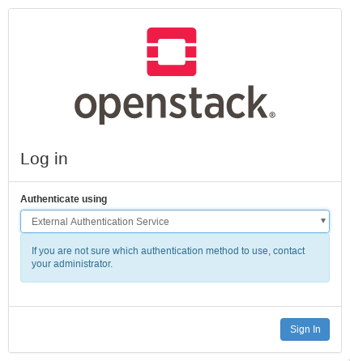
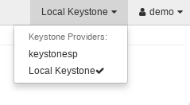

..
    Licensed under the Apache License, Version 2.0 (the "License"); you may not
    use this file except in compliance with the License. You may obtain a copy
    of the License at

        http://www.apache.org/licenses/LICENSE-2.0

    Unless required by applicable law or agreed to in writing, software
    distributed under the License is distributed on an "AS IS" BASIS, WITHOUT
    WARRANTIES OR CONDITIONS OF ANY KIND, either express or implied. See the
    License for the specific language governing permissions and limitations
    under the License.

Configuring Keystone for Federation
===================================

.. _keystone-as-sp:

-----------------------------------
Keystone as a Service Provider (SP)
-----------------------------------

.. _sp-prerequisites:

Prerequisites
-------------

If you are not familiar with the idea of federated identity, see the
:ref:`federation_introduction` first.

In this section, we will configure keystone as a Service Provider, consuming
identity properties issued by an external Identity Provider, such as SAML
assertions or OpenID Connect claims. For testing purposes, we recommend using
`samltest.id`_  as a SAML Identity Provider, or Google as an OpenID Connect
Identity Provider, and the examples here will references those providers. If you
plan to set up `Keystone as an Identity Provider (IdP)`_, it is easiest to set
up keystone with a dummy SAML provider first and then reconfigure it to point to
the keystone Identity Provider later.

The following configuration steps were performed on a machine running
Ubuntu 16.04 and Apache 2.4.18.

To enable federation, you'll need to run keystone behind a web server such as
Apache rather than running the WSGI application directly with uWSGI or Gunicorn.
See the installation guide for :ref:`SUSE <suse_configure_apache>`,
:ref:`RedHat <redhat_configure_apache>` or :ref:`Ubuntu
<ubuntu_configure_apache>` to configure the Apache web server for
keystone.

Throughout the rest of the guide, you will need to decide on three pieces of
information and use them consistently throughout your configuration:

1. The protocol name. This must be a valid keystone auth method and must match
   one of: ``saml2``, ``openid``, ``mapped`` or a :ref:`custom auth
   method <auth_plugins>` for which
   you must :ref:`register as an external driver <developing_drivers>`.

2. The identity provider name. This can be arbitrary.

3. The entity ID of the service provider. This should be a URN but need not
   resolve to anything.

You will also need to decide what HTTPD module to use as a Service Provider.
This guide provides examples for ``mod_shib`` and ``mod_auth_mellon`` as SAML
service providers, and ``mod_auth_openidc`` as an OpenID Connect Service
Provider.

.. note::

   In this guide, the keystone Service Provider is configured on a host called
   sp.keystone.example.org listening on the standard HTTPS port. All keystone
   paths will start with the keystone version prefix, ``/v3``. If you have
   configured keystone to listen on port 5000, or to respond on the path
   ``/identity`` (for example), take this into account in your own
   configuration.

.. _samltest.id: https://samltest.id

Creating federation resources in keystone
-----------------------------------------

You need to create three resources via the keystone API to identify the Identity
Provider to keystone and align remote user attributes with keystone objects:

* `Create an Identity Provider`_
* `Create a Mapping`_
* `Create a Protocol`_

See also the `keystone federation API reference`_.

.. _keystone federation API reference: https://docs.openstack.org/api-ref/identity/v3-ext/#os-federation-api

Create an Identity Provider
~~~~~~~~~~~~~~~~~~~~~~~~~~~

Create an Identity Provider object in keystone, which represents the Identity
Provider we will use to authenticate end users:

.. code-block:: console

   $ openstack identity provider create --remote-id https://samltest.id/saml/idp samltest

The value for the ``remote-id`` option is the unique identifier provided by the
Identity Provider, called the `entity ID` or the `remote ID`. For a SAML
Identity Provider, it can found by querying its metadata endpoint:

.. code-block:: console

   $ curl -s https://samltest.id/saml/idp | grep -o 'entityID=".*"'
   entityID="https://samltest.id/saml/idp"

For an OpenID Connect IdP, it is the Identity Provider's Issuer Identifier.
A remote ID must be globally unique: two identity providers cannot be associated
with the same remote ID. The remote ID will usually appear as a URN but need
not be a resolvable URL.

The local name, called ``samltest`` in our example, is decided by you and will
be used by the mapping and protocol, and later for authentication.

.. note::

   An identity provider keystone object may have multiple ``remote-ids``
   specified, this allows the same *keystone* identity provider resource to be
   used with multiple external identity providers. For example, an identity
   provider resource ``university-idp``, may have the following ``remote_ids``:
   ``['university-x', 'university-y', 'university-z']``.
   This removes the need to configure N identity providers in keystone.

See also the `API reference on identity providers`_.

.. _API reference on identity providers: https://docs.openstack.org/api-ref/identity/v3-ext/#identity-providers

.. _create_a_mapping:

Create a Mapping
~~~~~~~~~~~~~~~~

Next, create a mapping. A mapping is a set of rules that link the attributes of
a remote user to user properties that keystone understands. It is especially
useful for granting remote users authorization to keystone resources, either by
associating them with a local keystone group and inheriting its role
assignments, or dynamically provisioning projects within keystone based on these
rules.

.. note::

   By default, group memberships that a user gets from a mapping are only valid
   for the duration of the token. It is possible to persist these groups
   memberships for a limited period of time. To enable this, either
   set the ``authorization_ttl` attribute of the identity provider, or the
   ``[federation] default_authorization_ttl`` in the keystone.conf file. This
   value is in minutes, and will result in a lag from when a user is removed
   from a group in the identity provider, and when that will happen in keystone.
   Please consider your security requirements carefully.

An Identity Provider has exactly one mapping specified per protocol.
Mapping objects can be used multiple times by different combinations of Identity
Provider and Protocol.

As a simple example, create a mapping with a single rule to map all remote users
to a local user in a single group in keystone:

.. code-block:: console

   $ cat > rules.json <<EOF
   [
       {
           "local": [
               {
                   "user": {
                       "name": "{0}"
                   },
                   "group": {
                       "domain": {
                           "name": "Default"
                       },
                       "name": "federated_users"
                   }
               }
           ],
           "remote": [
               {
                   "type": "REMOTE_USER"
               }
           ]
       }
   ]
   EOF
   $ openstack mapping create --rules rules.json samltest_mapping

This mapping rule evaluates the ``REMOTE_USER`` variable set by the HTTPD auth
module and uses it to fill in the name of the local user in keystone. It also
ensures all remote users become effective members of the ``federated_users``
group, thereby inheriting the group's role assignments.

In this example, the ``federated_users`` group must exist in the keystone
Identity backend and must have a role assignment on some project, domain, or
system in order for federated users to have an authorization in keystone. For
example, to create the group:

.. code-block:: console

   $ openstack group create federated_users

Create a project these users should be assigned to:

.. code-block:: console

   $ openstack project create federated_project

Assign the group a ``member`` role in the project:

.. code-block:: console

   $ openstack role add --group federated_users --project federated_project member

Mappings can be quite complex. A detailed guide can be found on the
:doc:`mapping_combinations` page.

See also the `API reference on mapping rules`_.

.. _API reference on mapping rules: https://docs.openstack.org/api-ref/identity/v3-ext/#mappings

Create a Protocol
~~~~~~~~~~~~~~~~~

Now create a federation protocol. A federation protocol object links the
Identity Provider to a mapping.

You can create a protocol like this:

.. code-block:: console

   $ openstack federation protocol create saml2 \
   --mapping samltest_mapping --identity-provider samltest

As mentioned in :ref:`sp-prerequisites`, the name you give the protocol is not
arbitrary, it must be a valid auth method.

See also the `API reference for federation protocols`_.

.. _API reference for federation protocols: https://docs.openstack.org/api-ref/identity/v3-ext/#protocols

Configuring an HTTPD auth module
--------------------------------

This guide currently only includes examples for the Apache web server, but it
possible to use SAML, OpenIDC, and other auth modules in other web servers. See
the installation guides for running keystone behind Apache for
:ref:`SUSE <suse_configure_apache>`, :ref:`RedHat
<redhat_configure_apache>` or :ref:`Ubuntu <ubuntu_configure_apache>`.

Configure protected endpoints
~~~~~~~~~~~~~~~~~~~~~~~~~~~~~

There is a minimum of one endpoint that must be protected in the VirtualHost
configuration for the keystone service:

.. code-block:: apache

   <Location /v3/OS-FEDERATION/identity_providers/IDENTITYPROVIDER/protocols/PROTOCOL/auth>
     Require valid-user
     AuthType [...]
     ...
   </Location>

This is the endpoint for federated users to request an unscoped token.

If configuring WebSSO, you should also protect one or both of the following
endpoints:

.. code-block:: apache

   <Location /v3/auth/OS-FEDERATION/websso/PROTOCOL>
     Require valid-user
     AuthType [...]
     ...
   </Location>
   <Location /v3/auth/OS-FEDERATION/identity_providers/IDENTITYPROVIDER/protocols/PROTOCOL/websso>
     Require valid-user
     AuthType [...]
     ...
   </Location>

The first example only specifies a protocol, and keystone will use the incoming
remote ID to determine the Identity Provider. The second specifies the Identity
Provider directly, which must then be supplied to horizon when configuring
`horizon for WebSSO`_.

The path must exactly match the path that will be used to access the keystone
service. For example, if the identity provider you created in `Create an
Identity Provider`_ is ``samltest`` and the protocol you created in `Create a
Protocol`_ is ``saml2``, then the Locations will be:

.. code-block:: apache

   <Location /v3/OS-FEDERATION/identity_providers/samltest/protocols/saml2/auth>
     Require valid-user
     AuthType [...]
     ...
   </Location>
   <Location /v3/auth/OS-FEDERATION/websso/saml2>
     Require valid-user
     AuthType [...]
     ...
   </Location>
   <Location /v3/auth/OS-FEDERATION/identity_providers/samltest/protocols/saml2/websso>
     Require valid-user
     AuthType [...]
     ...
   </Location>

However, if you have configured the keystone service to use a virtual path such as
``/identity``, that part of the path should be included:

.. code-block:: apache

   <Location /identity/v3/OS-FEDERATION/identity_providers/samltest/protocols/saml2/auth>
     Require valid-user
     AuthType [...]
     ...
   </Location>
   ...

.. _horizon for WebSSO: `Configuring Horizon as a WebSSO Frontend`_

Configure the auth module
~~~~~~~~~~~~~~~~~~~~~~~~~

If your Identity Provider is a SAML IdP, there are two main Apache modules that
can be used as a SAML Service Provider: `mod_shib` and `mod_auth_mellon`. For
an OpenID Connect Identity Provider, `mod_auth_openidc` is used. You can also
use other auth modules such as kerberos, X.509, or others. Check the
documentation for the provider you choose for detailed installation and
configuration guidance.

Depending on the Service Provider module you've chosen, you will need to install
the applicable Apache module package and follow additional configuration steps.
This guide contains examples for two major federation protocols:

* SAML2.0 - see guides for the following implementations:

  * :ref:`Set up mod_shib <shibboleth>`.
  * :ref:`Set up mod_auth_mellon <mellon>`.

* OpenID Connect: :ref:`Set up mod_auth_openidc <federation_openidc>`.

.. _federation_configuring_keystone:

Configuring Keystone
--------------------

While the Apache module does the majority of the heavy lifting, minor changes
are needed to allow keystone to allow and understand federated authentication.

Add the Auth Method
~~~~~~~~~~~~~~~~~~~

Add the authentication methods to the ``[auth]`` section in ``keystone.conf``.
The auth method here must have the same name as the protocol you created in
`Create a Protocol`_. You should also remove ``external`` as an allowable
method.

.. code-block:: console

   [auth]
   methods = password,token,saml2,openid

Configure the Remote ID Attribute
~~~~~~~~~~~~~~~~~~~~~~~~~~~~~~~~~

Keystone is mostly apathetic about what HTTPD auth module you choose to
configure for your Service Provider, but must know what header key to look for
from the auth module to determine the Identity Provider's remote ID so it can
associate the incoming request with the Identity Provider resource. The key name
is decided by the auth module choice:

* For ``mod_shib``: use ``Shib-Identity-Provider``
* For ``mod_auth_mellon``: the attribute name is configured with the
  ``MellonIdP`` parameter in the VirtualHost configuration, if set to e.g.
  ``IDP`` then use ``MELLON_IDP``
* For ``mod_auth_openidc``: the attribute name is related to the
  ``OIDCClaimPrefix`` parameter in the Apache configuration, if set to e.g.
  ``OIDC-`` use ``HTTP_OIDC_ISS``

It is recommended that this option be set on a per-protocol basis by creating a
new section named after the protocol:

.. code-block:: ini

   [saml2]
   remote_id_attribute = Shib-Identity-Provider
   [openid]
   remote_id_attribute = HTTP_OIDC_ISS

Alternatively, a generic option may be set at the ``[federation]`` level.

.. code-block:: ini

  [federation]
  remote_id_attribute = HTTP_OIDC_ISS

Add a Trusted Dashboard (WebSSO)
~~~~~~~~~~~~~~~~~~~~~~~~~~~~~~~~

If you intend to configure horizon as a WebSSO frontend, you must specify the
URLs of trusted horizon servers. This value may be repeated multiple times. This
setting ensures that keystone only sends token data back to trusted servers.
This is performed as a precaution, specifically to prevent man-in-the-middle
(MITM) attacks. The value must exactly match the origin address sent by the
horizon server, including any trailing slashes.

.. code-block:: ini

  [federation]
  trusted_dashboard = https://horizon1.example.org/auth/websso/
  trusted_dashboard = https://horizon2.example.org/auth/websso/

Add the Callback Template (WebSSO)
~~~~~~~~~~~~~~~~~~~~~~~~~~~~~~~~~~

If you intend to configure horizon as a WebSSO frontend,  and if not already
done for you by your distribution's keystone package, copy the
`sso_callback_template.html`_ template into the location specified by the
``[federation]/sso_callback_template`` option in ``keystone.conf``. You can also
use this template as an example to create your own custom HTML redirect page.

Restart the keystone WSGI service or the Apache frontend service after making
changes to your keystone configuration.

.. code-block:: console

   # systemctl restart apache2

.. _sso_callback_template.html: https://opendev.org/openstack/keystone/raw/branch/master/etc/sso_callback_template.html

.. _horizon-websso:

Configuring Horizon as a WebSSO Frontend
----------------------------------------

.. note::

   Consult `horizon's official documentation`_ for details on configuring
   horizon.

.. _horizon's official documentation: https://docs.openstack.org/horizon/latest/configuration/settings.html

Keystone on its own is not capable of supporting a browser-based Single Sign-on
authentication flow such as the SAML2.0 WebSSO profile, therefore we must enlist
horizon's assistance. Horizon can be configured to support SSO by enabling it in
horizon's ``local_settings.py`` configuration file and adding the possible
authentication choices that will be presented to the user on the login screen.

Ensure the `WEBSSO_ENABLED` option is set to `True` in horizon's local_settings.py file,
this will provide users with an updated login screen for horizon.

.. code-block:: python

   WEBSSO_ENABLED = True

Configure the options for authenticating that a user may choose from at the
login screen. The pairs configured in this list map a user-friendly string to an
authentication option, which may be one of:

* The string ``credentials`` which forces horizon to present its own username
  and password fields that the user will use to authenticate as a local keystone
  user
* The name of a protocol that you created in `Create a Protocol`_, such as
  ``saml2`` or ``openid``, which will cause horizon to call keystone's `WebSSO
  API without an Identity Provider`_ to authenticate the user
* A string that maps to an Identity Provider and Protocol combination configured
  in ``WEBSSO_IDP_MAPPING`` which will cause horizon to call keystone's `WebSSO
  API specific to the given Identity Provider`_.

.. code-block:: python

   WEBSSO_CHOICES = (
       ("credentials", _("Keystone Credentials")),
       ("openid", _("OpenID Connect")),
       ("saml2", _("Security Assertion Markup Language")),
       ("myidp_openid", "Acme Corporation - OpenID Connect"),
       ("myidp_saml2", "Acme Corporation - SAML2")
   )

   WEBSSO_IDP_MAPPING = {
       "myidp_openid": ("myidp", "openid"),
       "myidp_saml2": ("myidp", "saml2")
   }

The initial selection of the dropdown menu can also be configured:

.. code-block:: python

   WEBSSO_INITIAL_CHOICE = "credentials"

Remember to restart the web server when finished configuring horizon:

.. code-block:: console

   # systemctl restart apache2

.. _WebSSO API without an Identity Provider: https://docs.openstack.org/api-ref/identity/v3-ext/index.html#web-single-sign-on-authentication-new-in-version-1-2
.. _WebSSO API specific to the given Identity Provider: https://docs.openstack.org/api-ref/identity/v3-ext/index.html#web-single-sign-on-authentication-new-in-version-1-3

Authenticating
--------------

Use the CLI to authenticate with a SAML2.0 Identity Provider
~~~~~~~~~~~~~~~~~~~~~~~~~~~~~~~~~~~~~~~~~~~~~~~~~~~~~~~~~~~~

.. FIXME(cmurphy): Include examples for OpenID Connect authentication with the CLI

The ``python-openstackclient`` can be used to authenticate a federated user in a
SAML Identity Provider to keystone.

.. note::

   The SAML Identity Provider must be configured to support the ECP
   authentication profile.

To use the CLI tool, you must have the name of the Identity Provider
resource in keystone, the name of the federation protocol configured in
keystone, and the ECP endpoint for the Identity Provider. If you are the cloud
administrator, the name of the Identity Provider and protocol was configured in
`Create an Identity Provider`_ and `Create a Protocol`_ respectively. If you are
not the administrator, you must obtain this information from the administrator.

The ECP endpoint for the Identity Provider can be obtained from its metadata
without involving an administrator. This endpoint is the
``urn:oasis:names:tc:SAML:2.0:bindings:SOAP`` binding in the metadata document:

.. code-block:: console

   $ curl -s https://samltest.id/saml/idp | grep urn:oasis:names:tc:SAML:2.0:bindings:SOAP
        <SingleSignOnService Binding="urn:oasis:names:tc:SAML:2.0:bindings:SOAP" Location="https://samltest.id/idp/profile/SAML2/SOAP/ECP"/>

~~~~~~~~~~~~~~~~~~~~~
Find available scopes
~~~~~~~~~~~~~~~~~~~~~

If you are a new user and are not aware of what resources you have access to,
you can use an unscoped query to list the projects or domains you have been
granted a role assignment on:

.. code-block:: bash

   export OS_AUTH_TYPE=v3samlpassword
   export OS_IDENTITY_PROVIDER=samltest
   export OS_IDENTITY_PROVIDER_URL=https://samltest.id/idp/profile/SAML2/SOAP/ECP
   export OS_PROTOCOL=saml2
   export OS_USERNAME=morty
   export OS_PASSWORD=panic
   export OS_AUTH_URL=https://sp.keystone.example.org/v3
   export OS_IDENTITY_API_VERSION=3
   openstack federation project list
   openstack federation domain list

~~~~~~~~~~~~~~~~~~
Get a scoped token
~~~~~~~~~~~~~~~~~~

If you already know the project, domain or system you wish to scope to, you can
directly request a scoped token:

.. code-block:: bash

   export OS_AUTH_TYPE=v3samlpassword
   export OS_IDENTITY_PROVIDER=samltest
   export OS_IDENTITY_PROVIDER_URL=https://samltest.id/idp/profile/SAML2/SOAP/ECP
   export OS_PROTOCOL=saml2
   export OS_USERNAME=morty
   export OS_PASSWORD=panic
   export OS_AUTH_URL=https://sp.keystone.example.org/v3
   export OS_IDENTITY_API_VERSION=3
   export OS_PROJECT_NAME=federated_project
   export OS_PROJECT_DOMAIN_NAME=Default
   openstack token issue

Use horizon to authenticate with an external Identity Provider
~~~~~~~~~~~~~~~~~~~~~~~~~~~~~~~~~~~~~~~~~~~~~~~~~~~~~~~~~~~~~~

When horizon is configured to enable WebSSO, a dropdown menu will appear on the
login screen before the user has authenticated. Select an authentication method
from the menu to be redirected to your Identity Provider for authentication.

.. _keystone_as_idp:

--------------------------------------
Keystone as an Identity Provider (IdP)
--------------------------------------

Prerequisites
-------------

When keystone is configured as an Identity Provider, it is often referred to as
`Keystone to Keystone`, because it enables federation between multiple OpenStack
clouds using the SAML2.0 protocol.

If you are not familiar with the idea of federated identity, see the
:ref:`introduction <federation_introduction>` first.

When setting up `Keystone to Keystone`, it is easiest to
:ref:`configure a keystone Service Provider <keystone-as-sp>`  first
with a sandbox Identity Provider such as
`samltest.id`_.

.. _samltest.id: https://samltest.id

This feature requires installation of the xmlsec1 tool via your distribution
packaging system (for instance apt or yum)

.. code-block:: console

   # apt-get install xmlsec1

.. note::

   In this guide, the keystone Identity Provider is configured on a host called
   idp.keystone.example.org listening on the standard HTTPS port. All keystone
   paths will start with the keystone version prefix, ``/v3``. If you have
   configured keystone to listen on port 5000, or to respond on the path
   ``/identity`` (for example), take this into account in your own
   configuration.

Configuring Metadata
--------------------

Since keystone is acting as a SAML Identity Provider, its metadata must be
configured in the ``[saml]`` section (not to be confused with an optional
``[saml2]`` section which you may have configured in `Configure the Remote Id
Attribute`_ while setting up keystone as Service Provider) of ``keystone.conf``
so that it can served by the `metadata API`_.

.. _metadata API: https://docs.openstack.org/api-ref/identity/v3-ext/index.html#retrieve-metadata-properties

The two parameters that **must** be set in order for keystone to generate
metadata are ``idp_entity_id`` and ``idp_sso_endpoint``:

.. code-block:: ini

   [saml]
   idp_entity_id=https://idp.keystone.example.org/v3/OS-FEDERATION/saml2/idp
   idp_sso_endpoint=https://idp.keystone.example.org/v3/OS-FEDERATION/saml2/sso

``idp_entity_id`` sets the Identity Provider entity ID, which is a string of
your choosing that uniquely identifies the Identity Provider to any Service
Provider.

``idp_sso_endpoint`` is required to generate valid metadata, but its value is
currently not used because keystone as an Identity Provider does not support the
SAML2.0 WebSSO auth profile. This may change in the future which is why there is
no default value provided and must be set by the operator.

For completeness, the following Organization and Contact configuration options
should also be updated to reflect your organization and administrator contact
details.

.. code-block:: ini

   idp_organization_name=example_company
   idp_organization_display_name=Example Corp.
   idp_organization_url=example.com
   idp_contact_company=example_company
   idp_contact_name=John
   idp_contact_surname=Smith
   idp_contact_email=jsmith@example.com
   idp_contact_telephone=555-555-5555
   idp_contact_type=technical

It is important to take note of the default ``certfile`` and ``keyfile``
options, and adjust them if necessary:

.. code-block:: ini

   certfile=/etc/keystone/ssl/certs/signing_cert.pem
   keyfile=/etc/keystone/ssl/private/signing_key.pem

You must generate a PKI key pair and copy the files to these paths. You can use
the ``openssl`` tool to do so. Keystone does not provide a utility for this.

Check the ``idp_metadata_path`` setting and adjust it if necessary:

.. code-block:: ini

   idp_metadata_path=/etc/keystone/saml2_idp_metadata.xml

To create metadata for your keystone IdP, run the ``keystone-manage`` command
and redirect the output to a file. For example:

.. code-block:: console

   # keystone-manage saml_idp_metadata > /etc/keystone/saml2_idp_metadata.xml

Finally, restart the keystone WSGI service or the web server frontend:

.. code-block:: console

   # systemctl restart apache2

Creating a Service Provider Resource
------------------------------------

Create a Service Provider resource to represent your Service Provider as an
object in keystone:

.. code-block:: console

   $ openstack service provider create keystonesp \
   --service-provider-url https://sp.keystone.example.org/Shibboleth.sso/SAML2/ECP
   --auth-url https://sp.keystone.example.org/v3/OS-FEDERATION/identity_providers/keystoneidp/protocols/saml2/auth

The ``--auth-url`` is the `federated auth endpoint`_ for a specific Identity
Provider and protocol name, here named ``keystoneidp`` and ``saml2``.

The ``--service-provider-url`` is the
``urn:oasis:names:tc:SAML:2.0:bindings:PAOS`` binding for the Assertion Consumer
Service of the Service Provider. It can be obtained from the Service Provider
metadata:

.. code-block:: console

   $ curl -s https://sp.keystone.example.org/Shibboleth.sso/Metadata | grep urn:oasis:names:tc:SAML:2.0:bindings:PAOS
   <md:AssertionConsumerService Binding="urn:oasis:names:tc:SAML:2.0:bindings:PAOS" Location="https://sp.keystone.example.org/Shibboleth.sso/SAML2/ECP" index="4"/>

.. _federated auth endpoint: https://docs.openstack.org/api-ref/identity/v3-ext/index.html#request-an-unscoped-os-federation-token

Authenticating
--------------

Use the CLI to authenticate with Keystone-to-Keystone
~~~~~~~~~~~~~~~~~~~~~~~~~~~~~~~~~~~~~~~~~~~~~~~~~~~~~

Use ``python-openstackclient`` to authenticate with the IdP and then get a
scoped token from the SP.

.. code-block:: console

   export OS_USERNAME=demo
   export OS_PASSWORD=nomoresecret
   export OS_AUTH_URL=https://idp.keystone.example.org/v3
   export OS_IDENTITY_API_VERSION=3
   export OS_PROJECT_NAME=federated_project
   export OS_PROJECT_DOMAIN_NAME=Default
   export OS_SERVICE_PROVIDER=keystonesp
   export OS_REMOTE_PROJECT_NAME=federated_project
   export OS_REMOTE_PROJECT_DOMAIN_NAME=Default
   openstack token issue

Use Horizon to switch clouds
~~~~~~~~~~~~~~~~~~~~~~~~~~~~

No additional configuration is necessary to enable horizon for
Keystone to Keystone. Log into the horizon instance for the Identity Provider
using your regular local keystone credentials. Once logged in, you will see a
Service Provider dropdown menu which you can use to switch your dashboard view
to another cloud.

.. include:: openidc.inc
.. include:: mellon.inc
.. include:: shibboleth.inc

