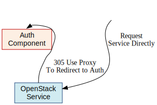
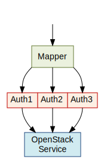

..
      Copyright 2011 OpenStack, LLC
      All Rights Reserved.

      Licensed under the Apache License, Version 2.0 (the "License"); you may
      not use this file except in compliance with the License. You may obtain
      a copy of the License at

          http://www.apache.org/licenses/LICENSE-2.0

      Unless required by applicable law or agreed to in writing, software
      distributed under the License is distributed on an "AS IS" BASIS, WITHOUT
      WARRANTIES OR CONDITIONS OF ANY KIND, either express or implied. See the
      License for the specific language governing permissions and limitations
      under the License.

=======================
Middleware Architecture
=======================

Abstract
========

The Keystone middleware architecture supports multiple authentication protocols
in a pluggable manner in OpenStack. By providing support for authentication via
pluggable authentication components, this architecture allows OpenStack
services to be integrated easily into existing deployment environments. It also
provides a path by which to implement support for emerging authentication
standards such as OAUTH.

Rationale and Goals
===================

Keystone is the Identity service for OpenStack. To support the easy integrating
of OpenStack with existing authentication and identity management systems,
Keystone supports talking to multiple backends like LDAP.
And to support different deployment needs, it can support multiple
authentication protocols via pluggable 'authentication components' implemented
as WSGI middleware.

In this document, we describe the responsibilities of the authentication
middleware. We describe how these interact with underlying OpenStack services
and how existing services can be modified to take advantage of pluggable
authentication. The goal is to allow OpenStack services to be integrated easily
into existing deployment environments and to provide a path by which to
implement support for emerging authentication standards such as OAUTH.

Specification Overview
======================

'Authentication' is the process of determining that users are who they say they
are. Typically, 'authentication protocols' such as HTTP Basic Auth, Digest
Access, public key, token, etc, are used to verify a user's identity. In this
document, we define an ''authentication component'' as a software module that
implements an authentication protocol for an OpenStack service.

At a high level, an authentication component is simply a reverse proxy that
intercepts HTTP calls from clients. Once it has verified a user's identity, the
authentication component extends the call with information about the current
user and forwards the request to the OpenStack service. Otherwise, if a user's
identity is not verified, the message is rejected before it gets to the
service. This is illustrated in :ref:`authComponent`.

.. _authComponent:

Authentication Component
------------------------

Figure 1. Authentication Component

.. image:: images/graphs_authComp.svg
   :width: 100%
   :height: 180
   :alt: An Authentication Component

Authentication components may operate in 'delegated mode'. In this mode, the
decision reject an unauthenticated client is delegated to the OpenStack
service. Delegated mode is illustrated in :ref:`authComponentDelegated`.

Here, requests are forwarded to the OpenStack service with an identity status
message that indicates whether the client's identity has been confirmed or is
indeterminate. It is the OpenStack service that decides whether or not a reject
message should be sent to the client. Note that it is always the responsibility
of the Authentication Component to transmit reject messages to the client.

.. _authComponentDelegated:

Authentication Component (Delegated Mode)
-----------------------------------------

Figure 2. Authentication Component (Delegated Mode)

.. image:: images/graphs_authCompDelegate.svg
   :width: 100%
   :height: 180
   :alt: An Authentication Component (Delegated Mode)

In this architecture, we define interactions between the authentication component
and the OpenStack service. Interactions between the client and the
authentication component are defined only for exceptional cases. For example,
we define the message that should be returned when the OpenStack service is
down. Other interactions, however, are defined by the underlying authentication
protocol and the OpenStack service and are considered out of scope.

.. _deployStrategies:

Deployment Strategies
=====================

An authentication component may be integrated directly into the service
implementation, or it may be deployed separately as an HTTP reverse proxy. This
is illustrated in :ref:`deployment`, showing both approaches to
authentication, labeled Option (a) and Option (b).

.. _deployment:

Authentication Component Deployments Options
--------------------------------------------

Figure 3. Authentication Component Deployments Options

.. image:: images/images_layouts.svg
   :width: 100%
   :height: 180
   :alt: Authentication Component Deployments Options

In Option (a), the component is integrated into the service implementation. In
this case, communication between the authentication component and the service
can be efficiently implemented via a method call. In Option (b), the component
is deployed separately and communication between the service and the component
involves an HTTP request. In both cases, unauthenticated requests are filtered
before they reach the service.

Each approach offers some benefits. Option (a) offers low latency and ease of
initial implementation, making it possibly most appropriate as a starting point
for simple configurations. Option (b) offers several key advantages that may be
of particular value in complex and dynamic configurations. It offers the
ability to scale horizontally in cases where authentication is computationally
expensive, such as when verifying digital signatures. Option (b) also allows
authentication components to be written in different programming languages.
Finally, Option (b) allows multiple authentication components to be deployed in
front of the same service.

OpenStack services can support both embedded (Option (a)) and external (Option
(b)) deployment strategies. Individual authentication components should support
either strategy or they |may| support both strategies. In order to support
option (a), authentication components written in the Python programming
language should be written as WSGI middleware components (in accordance with
the Web Server Gateway Interface (WSGI) standard [PEP-333]_.

Additionally, services should support the ability to swap between different
embedded or external authentication components via configuration options.

Exchanging User Information
===========================

If a request is successfully authenticated, the authentication component must
extend the request by adding an ``X-Authorization`` header. The header |must|
be formatted as illustrated in :ref:`xAuthHeader`.

.. _xAuthHeader:

X-Authorization Header
----------------------

Example 1. X-Authorization Header::

    X-Authorization: Proxy JoeUser

Here, `Proxy` denotes that the authentication occurred via a proxy (in this
case authentication component) and ''JoeUser'' is the name of the user who
issued the request.

.. note:

   We considered using an ``Authorization`` header rather than an
   ``X-Authorization``, thereby following normal HTTP semantics. There are some
   cases, however, where multiple ``Authorization`` headers need to be transmitted
   in a single request. We want to assure ourselves that this will not break
   common clients before we recommend the approach.

Authentication components |may| extend the request with additional
information. For example, an authentication system may add additional headers
or modify the target URI to pass authentication information to the back-end
service. Additionally, an authentication component |may| strip sensitive
information — a plain text password, for example — from the request. That said,
an authentication component |should| pass the majority of the request
unmodified.

Reverse Proxy Authentication
----------------------------

An OpenStack service |should| verify that it is receiving requests from a
trusted authentication component. This is particularly important in cases where
the authentication component and the OpenStack service are deployed separately.
In order to trust incoming requests, the OpenStack service should therefore
authenticate the authentication component. To avoid confusion, we call this
'reverse proxy authentication', since in this case the authentication
component is acting as an HTTP reverse proxy.

Any HTTP-based authentication scheme may be used for reverse proxy
authentication; however, all OpenStack services and all authentication
components |must| support HTTP Basic Authentication as defined in
[RFC-2617]_.

Whether or not reverse proxy authentication is required is strictly a
deployment concern. For example, an operations team may opt to utilize firewall
rules instead of an authentication protocol to verify the integrity of incoming
request. Because of this, both OpenStack services and authentication components
|must| also allow for unauthenticated communication.

In cases where reverse proxy authentication is used, the authorization
component may receive an HTTP 401 authentication error or an HTTP 403
authorization error. These errors indicate that the component does not have
access to the underlying OpenStack service. The authentication component
|must not| return these errors to the client application. Instead, the
component |must| return a 500 internal error. This is illustrated in
:ref:`proxyAuth` and :ref:`proxyAuthDelegated` below. The component
|should| format the errors in a manner that does not break the service
contract defined by the OpenStack service. :ref:`proxyAuthDelegated`
illustrates proxy authorization in delegated mode. Delegated mode is discussed
in detail in the next section.

.. _proxyAuth:

Reverse Proxy Authentication
----------------------------

Figure 4. Reverse Proxy Authentication

.. image:: images/graphs_proxyAuth.svg
   :width: 100%
   :height: 180
   :alt: Reverse Proxy Authentication

.. _proxyAuthDelegated:

Reverse Proxy Authentication (Delegated Mode)
---------------------------------------------

Figure 5. Reverse Proxy Authentication (Delegated Mode)

.. image:: images/graphs_delegate_forbiden_proxy.svg
   :width: 100%
   :height: 180
   :alt: Reverse Proxy Authentication (Delegated Mode)

Delegated Mode
==============
In some cases, the decision to reject an unauthenticated request should be
delegated to the OpenStack service. An unauthenticated request may be
appropriate in cases when anonymous access is allowed. In order to support
these cases, an authentication component may be placed in Delegated Mode. In
this mode, the component forwards requests to the OpenStack service when the
client's identity has been confirmed or is indeterminate — that is when
credentials are missing. The authentication component directly rejects requests
with invalid credentials. Authentication components |must| extend the
request by adding an `X-Identity-Status` header. The identity status header
|must| contain one of the following values:

Identity Status Values
----------------------

Confirmed
    A `confirmed` value indicates that valid credentials were sent and identity
    has been confirmed. The service can trust that the request has been sent on
    behalf of the user specified in the `X-Authorization` header.

Indeterminate
    An `indeterminate` value indicates that no credentials were sent and
    identity has not been confirmed. In this case, the service will receive an
    `X-Authorization` header with no user entry as illustrated in
    :ref:`xauth-header-indeterminate`.

.. _xauth-header-indeterminate:

Indeterminate Identity Headers
------------------------------

Example 2. Indeterminate Identity Headers::

    X-Identity-Status: Indeterminate
    X-Authorization: Proxy

Services |may| reject a delegated request by issuing an HTTP 401
authentication error or an HTTP 403 authorization error. These responses
|must| contain an ``WWW-Authenticate`` header with a value of ``Delegated`` as
illustrated in :ref:`unauthHeaders`.

X-Identity-Status
    Provides information on whether the request was authenticated or not.

X-Tenant
    Provides the tenant ID (as it appears in the URL in Keystone). This is to support any legacy implementations before Keystone switched to an ID/Name schema for tenants.

X-Tenant-Id
    The unique, immutable tenant Id

X-Tenant-Name
    The unique, but mutable (it can change) tenant name.

X-User-Id
    The user id of the user used to log in

X-User-Name
    The username used to log in

X-User
    The username used to log in. This is to support any legacy implementations before Keystone switched to an ID/Name schema for tenants.

X-Roles
    The roles associated with that user

.. _unauthHeaders:

Delegated WWW-Authenticate Header
---------------------------------

::

    WWW-Authenticate: Delegated

It is important to note that the actual reject message will likely be modified
by the authentication component in order to comply with the authentication
scheme it is implementing. This is illustrated in :ref:`delegateRejectBasic` and
:ref:`delegateRejectOAuth` below.

.. _delegateRejectBasic:

Delegated Reject Basic Auth
---------------------------

.. image:: images/graphs_delegate_reject_basic.svg
   :width: 100%
   :height: 180
   :alt: Delegated Reject Basic Auth

.. _delegateRejectOAuth:

Delegated Reject OAuth
----------------------

.. image:: images/graphs_delegate_reject_oauth.svg
   :width: 100%
   :height: 180
   :alt: Delegated Reject OAuth

The presence of the `WWW-Authenticate` header with a value of `Delegated`
distinguishes a client authentication/authorization failure from a component
failure. For example, compare :ref:`delegateForbidden` with :ref:`proxyAuthDelegated`. In
:ref:`delegateForbidden`, the client is not allowed to access the OpenStack service.
In :ref:`proxyAuthDelegated`, it is the authentication component itself which is
unauthorized.

.. _delegateForbidden:

Delegated Reject Forbidden
--------------------------

Figure 8. Delegated Reject Forbidden

.. image:: images/graphs_delegate_forbiden_basic.svg
   :width: 100%
   :height: 180
   :alt: Delegated Reject Forbidden

Authentication components |must| support both delegated and undelegated
(standard) modes. Delegated mode |should| be configured via a configuration
option. Delegated mode |should| be disabled by default.

OpenStack services are not required to support delegated mode. If a service
does not support delegated mode, it |must| respond with a 501 not implemented
error and an `WWW-Authenticate` header with a value of `Delegated`. The
authentication component |must not| return the error to the client
application. Instead, the component |must| return a 500 internal error; this is
illustrated in :ref:`delegateUnimplemented`. The component |should|
format the error in a manner that does not break the service contract defined
by the OpenStack service. The component should also log the error such that it
that will inform operators of the misconfiguration.

.. _delegateUnimplemented:

Unimplemented Delegated Mode
----------------------------

.. image:: images/graphs_delegate_unimplemented.svg
   :width: 100%
   :height: 180
   :alt: Unimplemented Delegated Mode

Handling Direct Client Connections
==================================

Requests from the authentication component to an OpenStack service |must|
contain an ``X-Authorization`` header. If the header is missing, and reverse
proxy authentication fails or is switched off, the OpenStack service |may|
assume that the request is coming directly from a client application. In this
case, the OpenStack service |must| redirect the request to the authentication
component by issuing an HTTP 305 User Proxy redirect. This is illustrated in
:ref:`redirect`. Note that the redirect response |must| include a ``Location`` header
specifying the authentication component's URL as shown in :ref:`redirect-response`.

.. _redirect:

Auth Component Redirect
-----------------------

.. _redirect-response:

Auth Component Redirect Response
--------------------------------

::

    HTTP/1.1 305 Use Proxy
    Date: Thu, 28 Oct 2011 07:41:16 GMT
    Location: http://sample.auth.openstack.com/path/to/resource

Using Multiple Authentication Components
========================================

There are some use cases when a service provider might want to consider using
multiple authentication components for different purposes. For instance, a
service provider may have one authentication scheme to authenticate the users
of the service and another one to authenticate the administrators or operations
personnel that maintain the service. For such scenarios, we propose using a
mapper as illustrated in :ref:`multiAuth`.

.. _multiAuth:

Multiple Authentication Components
----------------------------------

At a high level, a mapper is a simple reverse proxy that intercepts HTTP calls
from clients and routes the request to the appropriate authentication
component. A mapper can make the routing decisions based on a number of routing
rules that map a resource to a specific authentication component. For example,
a request URI may determine whether a call should be authenticated via one
authentication component or another.

Note that neither the authentication component nor the OpenStack service need
be aware of the mapper. Any external authentication component can be used
alongside others. Mappers may provide a means by which to offer support for
anonymous or guest access to a subset of service resources. A mapper may be
implemented via a traditional reverse proxy server such as Pound or Zeus.

The Default Component
=====================

Individual services |must| be distributed with a simple integrated
authentication component by default. Providing such a component lowers barriers
to the deployment of individual services. This is especially important to]
developers who may want to deploy OpenStack services on their own machines.
Also, since there is no direct dependency on an external authentication system,
OpenStack services can be deployed individually, without the need to stand up
and configure additional services. Finally, having a standard authentication
component that all services share promotes a separation of concerns. That is,
as a community we are explicitly stating that services should not develop their
own authentication mechanisms. Additional authentication components may be
developed, of course, but these components should not be intimately coupled to
any one particular service.

As discussed in :ref:`deployStrategies`, an authentication component may be
integrated directly into the service implementation (Option (a)), or it may be
deployed separately as an HTTP reverse proxy (Option (b)). The default
component should be implemented to support Option (a) and services should
maintain support for Option (b). One way to achieve this is to provide a
method that allows the disabling of the default authentication component via
configuration. This is illustrated in :ref:`both`. Here, requests are
sent directly to the OpenStack service when the default authentication
component is disabled.

We will discuss the design of the default component in an upcoming blueprint.

.. _both:

Disabled Embedded Component
---------------------------

.. image:: images/graphs_both.svg
   :width: 100%
   :height: 250
   :alt: Disabled Embedded Component

Questions and Answers
=====================

#. Why do authentication components send reject messages? Why not have
   OpenStack services reject requests themselves?

   The content and format of an authentication failed message is determined by
   the authentication scheme (or protocol). For the service to respond
   appropriately, it would have to be aware of the authentication scheme in
   which it participates; this defeats the purpose of pluggable authentication
   components.

#. Why require support for deploying authentication components in separate
   nodes?

   The deployment strategy is very flexible. It allows for authentication
   components to be horizontally scalable. It allows for components to be written
   in different languages. Finally, it allows different authentication components
   to be deployed simultaneously as described above.

References
==========

.. [PEP-333] pep0333 Phillip J Eby.  'Python Web Server Gateway Interface
    v1.0.''  http://www.python.org/dev/peps/pep-0333/.

.. [RFC-2617] rfc2617 J Franks.  P Hallam-Baker.  J Hostetler.  S Lawrence.
    P Leach.  A Luotonen.  L Stewart.  ''HTTP Authentication: Basic and Digest
    Access Authentication.''  http://tools.ietf.org/html/rfc2617.

.. |must| replace:: must must
.. |should| replace:: should should
.. |may| replace:: may may
.. |must not| replace:: "must not" "must not"

